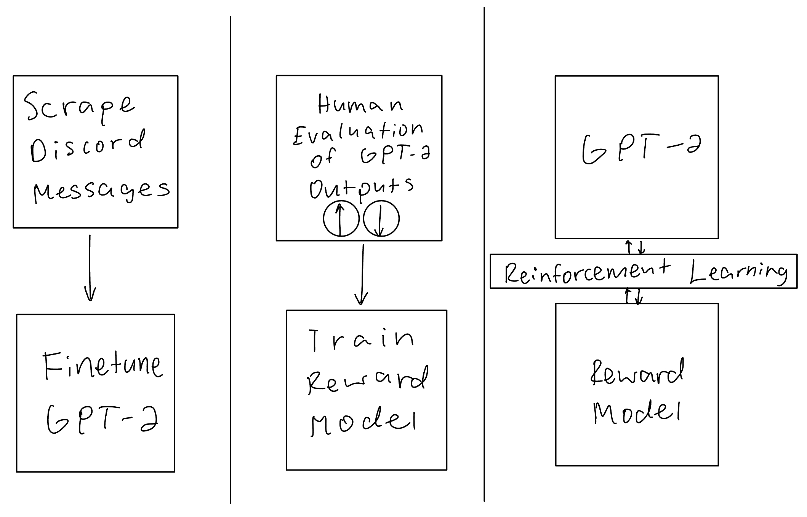

# Bobby Bot

## Description
This bot uses GPT-2 to converse with people on Discord servers. Bobby Bot first finetunes on the data present in the server. This is so that Bobby Bot learns the facts about your server as well as how people talk on your server. After this, whenever you mention Bobby in a message, Bobby Bot will respond with a message. People then can give this message a thumbs up or a thumbs down depending on how much they like the repsonse. This data will be used to train a reward model which learns how much reward a model output should get. This model will then be used to perform reinforcement learning on the GPT-2 model. 

## How To Run It
To install dependencies, either run `pipenv install` or `pip install -r requirements.txt` depending on if you use [pipenv](https://pipenv.pypa.io/en/latest/) or pip. 

To run this program, you first need a Discord bot. Once you obtain the Discord bot's token, place that token in `./token` so that that program can use your bot. After this, create a directory called `./data/` run `scrape.py` and wait for it to scrape all the messages from the servers it is on. This may take a very long depending on how many messages are present on each server (should be able to scrape around 100 messages / second). After scraping is done, run `train.py` and wait for the model to train. After this, run `bot.py`.

## Future Work
Reinforcement learning from human judging still needs to be implemented. Currently, it is just generating messages based on its training data alone, with no human judging. I plan to take inspiration from [OpenAI's training process of ChatGPT](https://openai.com/blog/chatgpt/) to train Bobby Bot to be very good at responding.